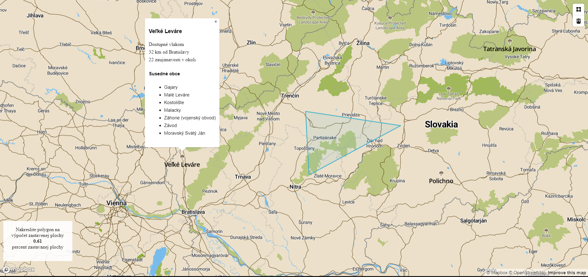

# Overview

Application shows TOP10 green cities in Slovakia. You can draw polygon on map and application calculates the ratio of built-up area in polygon. When you can click on "green city", application show description of city: if there is railway, distance from Bratislava, number of POI arround the city and   neighboring cities

This is it in action:

Features:
- Calculate the ratio of built-up area in drawed polygon.
- Show TOP10 green cities in Slovakia (cities where are nature rate the highest).
- Show distance between city and Bratislava.
- Check if in city is railway.
- Show neighboring cities.

The application has 2 separate parts, the client which is a [frontend web application](app/views/index.ejs) using mapbox API and mapbox.js and the [backend application](app/app.js) written in JavaScript, backed by PostGIS. The frontend application communicates with backend using a API.

# Frontend

The frontend application is a static HTML page (`index.html`), which shows a mapbox.js widget. It is displaying TOP10 green cities and you can draw polygon to calculate the ratio of built-up area. You can click on green city icon to show detail about city. We modified map visualization in mapbox web app to improve user experience with using our map.

# Backend

The backend server is Node.JS and we use framework Express. 

## Data

Data is directly from Open Street Maps. I downloaded an extent covering whole Slovakia and imported it using the `osm2pgsql` tool into the standard OSM schema. 
To speedup the queries I created an index on geometry column (`way`) in all tables and for collumns, which I use in queries. All queries for create index are placed in models inside [index.sql](index.sql). All queries for select are placed in models inside [query.sql](query.sql). GeoJSON is generated by using a standard `st_asgeojson` function.

