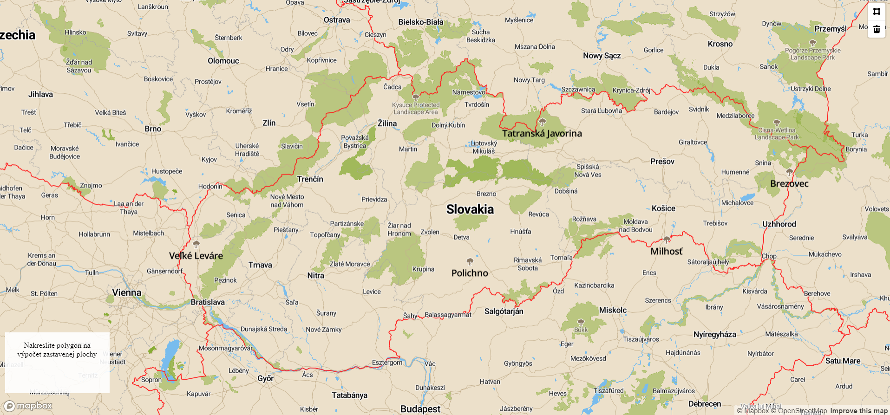
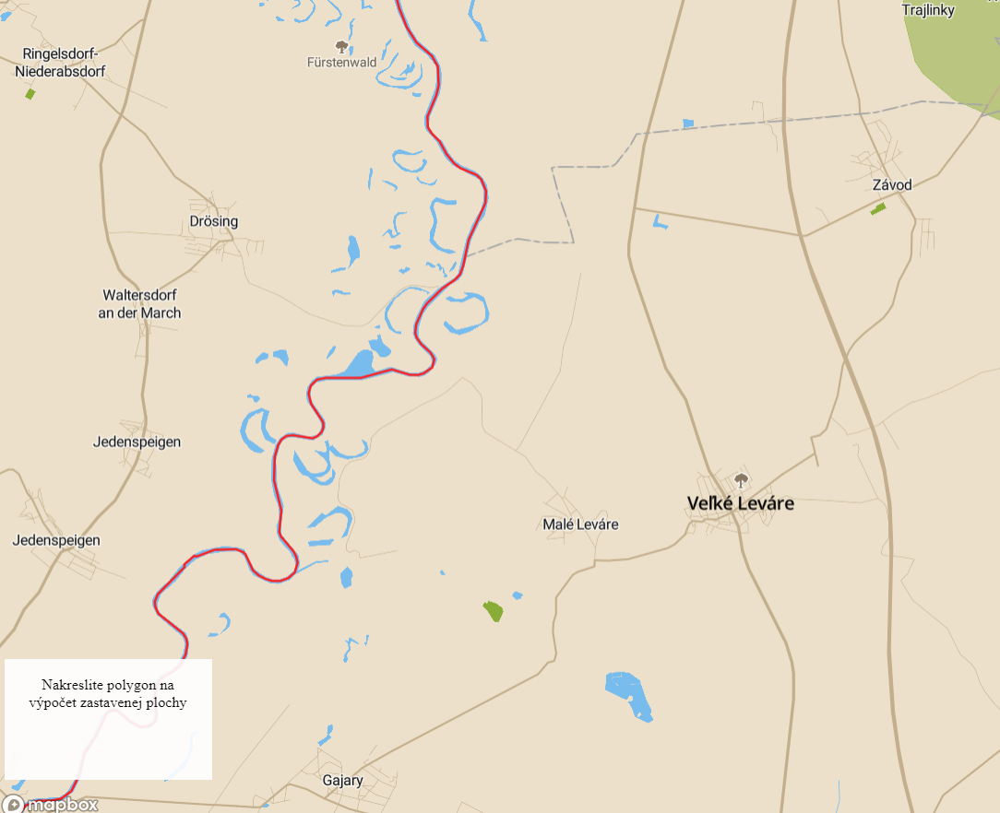
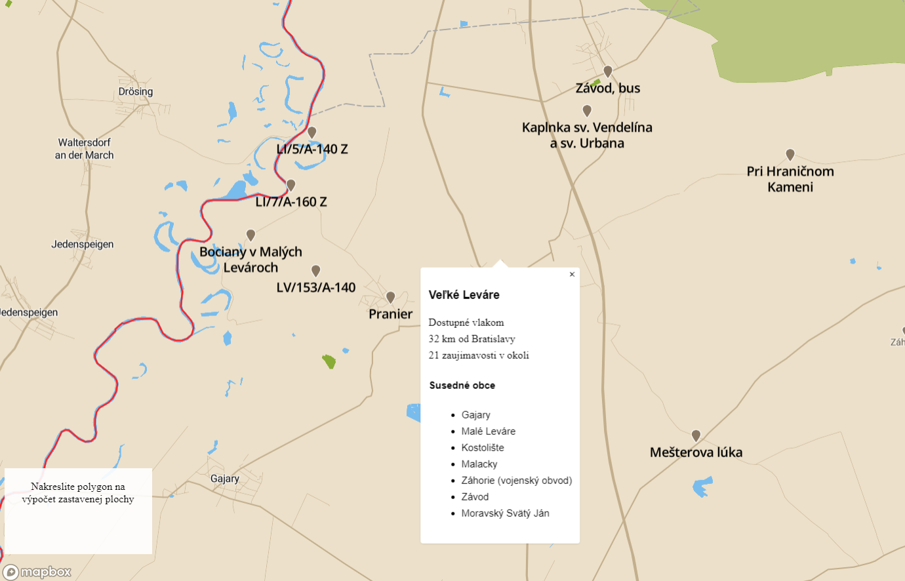
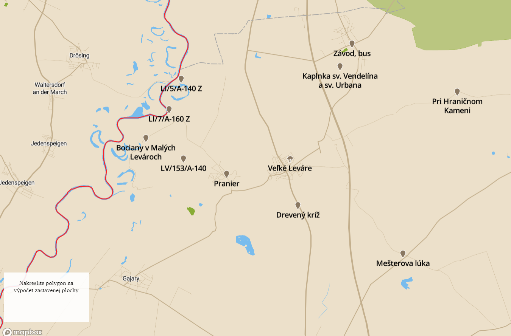

# Overview

Application shows TOP10 green cities in Slovakia. You can draw polygon on map and application calculates the ratio of built-up area in polygon. When you can click on "green city", application show description of city: if there is railway, distance from Bratislava, number of POI arround the city and   neighboring cities

This is it in action:







Features:
- Calculate the ratio of built-up area in drawed polygon.
- Show TOP10 green cities in Slovakia (cities where are nature rate the highest).
- Show distance between city and Bratislava.
- Check if in city is railway.
- Show neighboring cities.
- Show interesting POI around the city.

The application has 2 separate parts, the client which is a [frontend web application](app/views/index.ejs) using mapbox API and mapbox.js and the [backend application](app/app.js) written in JavaScript, backed by PostGIS. The frontend application communicates with backend using a API.

# Frontend

The frontend application is a static HTML page (`index.html`), which shows a mapbox.js widget. It is displaying TOP10 green cities and you can draw polygon to calculate the ratio of built-up area. You can click on green city icon to show detail about city. We modified map visualization in mapbox web app to improve user experience with using our map.


# Backend

The backend server is Node.JS and we use framework Express. 

## Data

Data is directly from Open Street Maps. I downloaded an extent covering whole Slovakia and imported it using the `osm2pgsql` tool into the standard OSM schema. 
To speedup the queries I created an index on geometry column (`way`) in all tables and for collumns, which I use in queries. All queries for create index are placed in models inside [index.sql](index.sql). All queries for select are placed in models inside [query.sql](query.sql). GeoJSON is generated by using a standard `st_asgeojson` function.

## SQL
```sql
CREATE INDEX planet_osm_point_index ON public.planet_osm_point USING gist(way);
CREATE INDEX point_index_historic ON public.planet_osm_point (historic);
CREATE INDEX point_index_sport ON public.planet_osm_point (sport);
CREATE INDEX planet_osm_polygon_index ON public.planet_osm_polygon USING gist(way);
CREATE INDEX polygon_index_admin_level ON public.planet_osm_polygon (admin_level);
CREATE INDEX polygon_index_admin_name ON public.planet_osm_polygon (name);
CREATE INDEX polygon_index_admin_name ON public.planet_osm_polygon (name);
CREATE INDEX polygon_index_admin_boundary ON public.planet_osm_polygon  (boundary);
CREATE INDEX polygon_index_admin_natural ON public.planet_osm_polygon ("natural");
CREATE INDEX planet_osm_roads_index ON public.planet_osm_roads USING gist(way);
CREATE INDEX roads_index_admin_boundary ON public.planet_osm_roads (railway);

-- osm_id example = '-2206974'
-- polygon example = '{"coordinates":[[[17.396888342971664,48.675609488238194],[17.35356858709514,48.66376159570285],[17.343504401392607,48.69409819149374],[17.396888342971664,48.675609488238194]]],"type":"Polygon"}'

-- Query for green cities
SELECT 
	name, 
	osm_id, 
	ST_AsGeoJSON(ST_Centroid(ST_Transform(way, 4326))) as centroid	
FROM (	
	SELECT 	
		cities.name as name,	
		cities.way as way, 	
		cities.osm_id as osm_id, 
		SUM(ST_Area(polygons.way))/ST_Area(cities.way) as nature_perc 	
	FROM 	
		planet_osm_polygon polygons 	
	JOIN (	
		SELECT DISTINCT name,way,osm_id 	
		FROM planet_osm_polygon 	
		WHERE boundary='administrative' AND admin_level='9' AND name IS NOT NULL) as cities	
	ON ST_Contains(cities.way,polygons.way) WHERE polygons.natural IS NOT NULL	
	GROUP BY 1,2,3	
	ORDER BY 4 DESC	
	LIMIT 10) as result;

-- Query for percentage of built-up area
SELECT 
	SUM(ST_Area(ST_Intersection(ST_Transform(ST_SetSRID(ST_GeomFromGeoJSON($1),4326),3857),way)))				\
	   ST_Area(ST_Transform(ST_SetSRID(ST_GeomFromGeoJSON($1),4326),3857))*100	AS result 							
FROM 
	planet_osm_polygon osm 																						
WHERE 
	ST_Intersects(ST_Transform(ST_SetSRID(ST_GeomFromGeoJSON($1),4326),3857),way) 
	AND osm.building IS NOT NULL;
	
-- Query for neighboring cities
SELECT 
	 cities.name as name
FROM (
	SELECT name,way 
	FROM planet_osm_polygon 
	WHERE boundary='administrative' AND admin_level='9' AND name IS NOT NULL ) as cities 
JOIN 
	(SELECT way 
	FROM planet_osm_polygon 
	WHERE boundary='administrative' AND admin_level='9' AND osm_id = $1 )  as city
ON ST_Touches(cities.way,city.way);

-- Query for POI around city
SELECT 	
	COUNT(*) as count	
FROM planet_osm_point poi	
JOIN (	
	SELECT way 	
	FROM planet_osm_polygon 	
	WHERE boundary='administrative' AND admin_level='9' AND osm_id = $1 LIMIT 1 )  as city	
ON	ST_DWithin(poi.way,city.way,4000)	
WHERE 	
	poi.historic IS NOT NULL OR poi.sport IS NOT NULL;
	
-- Query for distance between city and Bratislava
SELECT 
	 ST_Distance(ST_Transform(ba_city.way,2163),ST_Transform(city.way,2163))/1000 AS distance
FROM (	
	SELECT way 	
	FROM planet_osm_polygon 	
	WHERE boundary='administrative' AND admin_level='9' AND name='Bratislava - mestská časť Staré Mesto' LIMIT 1) ba_city	
CROSS JOIN (	
	SELECT way 	
	FROM planet_osm_polygon 	
	WHERE boundary='administrative' AND admin_level='9' AND osm_id=$1 LIMIT 1)  as city
	
-- Query for check if train is in city
SELECT 	
	SUM(ST_Length(osm.way)) as rail_length	
FROM planet_osm_roads osm	
JOIN (
	SELECT way 
	FROM planet_osm_polygon 
	WHERE osm_id = $1 LIMIT 1) as city
ON ST_Intersects(city.way,osm.way)	
WHERE 
	railway = 'rail';
```


